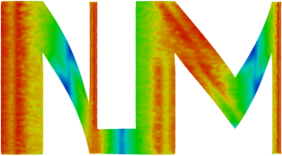

{ width=40% }

# Summary

The open source code *NLMech* is an implementation of finite difference approximation of nonlocal models, \emph{e.g.}\ peridynamic. Peridynamic (PD) [@silling2007peridynamic;@silling2005meshfree] is a nonlocal formulation of classical continuum mechanics that is particularly robust in mechanical deformations involving crack (discontinuous displacement) and damage. The model seamlessly handles the two regimes of deformation: elastic/smooth deformation and fracture. The constitutive laws describing the material behavior are simple to conceptualize and implement. Particularly, in numerical implementation, no special care for the modeling of cracks is required. Successful comparison of PD against a variety of experiments has been done [@diehl2019review]. 

Unlike classical continuum mechanics, where the internal force is written in terms of the stress, in PD, the internal force at a given material point is due to the sum of the pairwise forces of the neighboring points. \emph{i.e.}\ the force in PD is expressed as the integral of the pairwise force density between the given point and another point in the neighborhood. The neighborhood of point $x$ is typically defined as all points in the sphere of radius $\delta$, centered at $x$, where $\delta$ is the nonlocal length scale and is referred to as \textit{horizon}. PD is often divided in two classes: bond-based and state-based models. In bond-based models, the two material points interact via a pairwise force law and the forces between the material points do not depend on the deformation state of surrounding points. In contrast, in the state-based models the volumetric deformation in the neighborhood of two points plays a role in the pairwise force. The governing equation of motion for the bond-based PD [@silling2005meshfree] reads as

$$ \varrho(\mathbf{X})\ddot{\mathbf{u}}(t,\mathbf{X}) = \int\limits_{B_\delta(\mathbf{X})}\mathbf{f}(\mathbf{u}(t,\mathbf{X}')-\mathbf{u}(t,\mathbf{X}),\mathbf{X}'-\mathbf{X}) d\mathbf{X}' + \mathbf{b}(t,\mathbf{X}) \text{ in } D$$

and the governing equation for the state-based PD [@silling2007peridynamic] reads as 

$$  \varrho (\mathbf{X})\ddot{\mathbf{u}}(t,\mathbf{X}) =  \int\limits_{B_\delta(\mathbf{X})} (T[\mathbf{X},t]\langle \mathbf{X}' - \mathbf{X} \rangle - T[\mathbf{X}',t]\langle \mathbf{X} - \mathbf{X}' \rangle) d\mathbf{X}' + \mathbf{b}(t,\mathbf{X}) \text{ in } D \text{.} $$
Here $\varrho$ denotes density of the material, $\mathbf{u}$ displacement field in the material, $\ddot{\mathbf{u}}$ acceleration, and $\mathbf{b}$ external force density. The constitutive law, relating bond strain with bond force, is prescribed using either the pairwise force function $\mathbf{f}$ or the PD state $T$ [@silling2007peridynamic]. In the NLMech library, the following material models are implemented:

* Elastic state-based PD model [@silling2007peridynamic],
* Prototype micro-elastic brittle bond-based PD model [@silling2005meshfree],
* Nonlinear bond-based PD model [@lipton2014dynamic;@lipton2016cohesive], and
* Nonlocal double-well state-based peridynamic model [@Lipton2018;@jha2019numerical].

Examples for these types of model implementations are provided in the [documentation](https://nonlocalmodels.github.io/examples/).

Currently, the library supports finite difference (or more generally meshfree) discretization. Using the triangulation of an arbitrary domain, the library can create a meshfree discretization. The library is equipped with necessary modules, such as FE elements and quadrature integration rules, for finite element discretization of PD. Next, we briefly discuss the finite difference/meshfree discretization of PD. \autoref{fig:discrete} shows the domain D discretized with the nodes $X = \{ X_i \in \mathbb{R}^3 \vert i=1,\ldots,n\}$. Each node $X_i$ represents a small area/volume denoted by $V_i$. In PD, as previously mentioned, each point $X_i$ interacts with neighboring points in the sphere (discrete)  $B_\delta(X_i) = \{X_j: |X_i - X_j| < \delta \}$. 

![ Adapted from [@Diehl2020].\label{fig:discrete}](discrete.pdf){ width=30% }

The discrete equation of motion is written as, for the bond-based PD,

$$ \varrho(X_i)\ddot{\mathbf{u}}(t,X_i) = \sum\limits_{j \in B_\delta(X_i)}\mathbf{f}(\mathbf{u}(t,X_j)-\mathbf{u}(t,X_i),X_j-X_i) V_j + \mathbf{b}(t,X_i) \text{ in } D,$$

and, the state-based PD,

$$  \varrho (X_i)\ddot{\mathbf{u}}(t,X_i) =  \sum\limits_{j \in B_\delta(X_i)} (T[X_i,t]\langle X_j - X_i \rangle - T[X_j,t]\langle X_i - X_j \rangle) V_j + \mathbf{b}(t,X_i) \text{ in } D \text{.} $$

Here $\mathbf{u}(t,X_i)$ denotes the displacement of node $X_i$ at time $0 \leq t\leq T$. For the time discretization, we can consider: \textit{1)} implicit time integration and \textit{2)} explicit time integration using either a central difference or velocity verlet scheme.

## Software Implementation and Applications

NLMech relies on the following open source softwares: HPX [@Kaiser2020], Blaze [@iglberger2012high], Blaze_Iterative, Gmsh [@geuzaine2009gmsh], VTK [@schroeder2004visualization], and yaml-cpp. For details 
about the specific version, we refer to NLMech's [documentation](https://github.com/nonlocalmodels/NLMech#building).

NLMech was used for the following applications/publications:

* Numerical convergence of finite difference approximations for state based perdidynamic fracture
models [@jha2019numerical] 
* Complex fracture nucleation and evolution with nonlocal elastodynamics [@lipton2019complex]
* Free damage propagation with memory [@lipton2018free] 
* Kinetic relations and local energy balance for linear elastic fracture mechanics from a
nonlocal peridynamic model [@jha2020kinetic]

For an updated list of applications/publications, we refer to corresponding [NLMech documentation](https://nonlocalmodels.github.io/publications/).

# Statement of need

Nonlocal models, like peridynamic, are computationally expensive. Several 
publications on GPU-based implementations [@mossaiby2017opencl;@diehl2012implementierung;@diehl2015efficient] and one commercial implementation in LS-DYNA [@ren20173d] can be found in literature. However, 
from an open source perspective, only two other peridynamic implementations are available: [Peridigm](https://github.com/peridigm/peridigm) [@littlewood2015roadmap] and [PDLammps](https://lammps.sandia.gov/doc/pair_peri.html) [@parks2008implementing]. Both of these codes rely on the Message Passing Interface (MPI). On modern supercomputers' many core architectures where the threads per computational node increase, it is more and more important to focus on the fine-grain parallelism with increasing cores per computational nodes. NLMech is based on the C++ standard library for parallelism and concurrency (HPX) [@Kaiser2020]. For more details on utilization of asynchronous many-task systems, we refer to @diehl2018implementation. The library implements the experimental nonlinear bond-based and state-based models, and the process of adding new material models is simple following the existing templates.

# Future directions

We are interested in extending/improving the library with

- implementation of new material models,
- higher order time discretization schemes,
- local-nonlocal coupling methods, and
- further optimization of nonlocal computation. 
 
If you are interested in contributing, please read our [guidelines](https://github.com/nonlocalmodels/NLMech#contributing) and our [code of conduct](https://github.com/nonlocalmodels/NLMech/blob/master/CODE_OF_CONDUCT.md) before doing so. 

# Acknowledgments

NLMech has been funded by:

*  Army Research Office Grant # W911NF-16-1-0456 to PI Dr. Robert Lipton (Professor at Louisiana State University). This grant supported Prashant K. Jha on a postdoctoral position from October 2016 - July 2019.
*  Canada Research Chairs Program under the Canada Research Chair in Multiscale Modelling of Advanced Aerospace Materials held by M. Lévesque; Natural Sciences and Engineering Research Council of Canada (NSERC) Discovery Grants Program under Discovery Grant RGPIN-2016-06412.
* We are grateful for the support of the Google Summer of Code program funding internships.

For a updated list of previous and current funding, we refer to the corresponding [NLMech website](https://github.com/nonlocalmodels/NLMech#acknowledgements).

# References
