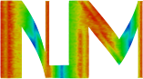

# Summary

The open source code *NLMech* is an implementation of finite element and finite difference approximation of nonlocal models, \emph{e.g.}\ peridynamic. Peridyanmic (PD) [@silling2007peridynamic,@silling2005meshfree] is a nonlocal formulation of classical continuum mechanics wit a focus on 
discontinuities as they arise at crack and fractures. Successful comparison against a variety of experiments have been done [@diehl2019review]. The governing equation of motion for bond-based PD [@silling2005meshfree] reads as

$$ \varrho(\mathbf{X})\ddot{\mathbf{u}}(t,\mathbf{X}) = \int\limits_{B_\delta(\mathbf{X})}\mathbf{f}(\mathbf{u}(t,\mathbf{X}')-\mathbf{u}(t,\mathbf{X}),\mathbf{X}'-\mathbf{X}) d\mathbf{X}' + \mathbf{b}(t,\mathbf{X}) \text{ in } \Omega$$

and the governing equation for state-based PD [@silling2007peridynamic] reads as 

$$  \varrho (\mathbf{X})\ddot{\mathbf{u}}(t,\mathbf{X}) =  \int\limits_{B_\delta(\mathbf{X})} (T[\mathbf{X},t]\langle \mathbf{X}' - \mathbf{X} \rangle - T[\mathbf{X}',t]\langle \mathbf{X} - \mathbf{X}' \rangle) d\mathbf{X}' + \mathbf{b}(t,\mathbf{X}) \text{ in } \Omega \text{.} $$
Where $\varrho$ is the material's density, $\ddot{\mathbf{u}}$ is the acceleration, and $\mathbf{b}(t,\mathbf{X})$ is the external force density. The constitutive law of the material is described in the pair-wise force function $\mathbf{f}$ or the PD state $T$. Following materials models are implemented:

* Elastic state-based PD model [@silling2007peridynamic],
* Prototype micro-elastic brittle bond-based PD model [@silling2005meshfree],
* Nonlinear bond-based PD model [@lipton2014dynamic,@lipton2016cohesive], and
* Nonlocal Double Well state-based peridynamic model [@Lipton2018].

For example input files for these models, we refer to the collection of [examples](https://nonlocalmodels.github.io/examples/) in the documentation.

For the discretization in space two schemes: \textit{1)} a finite difference approximation and \text{2)} a finite element approximation is implemented. We briefly introduce the finite difference scheme and for the more complex finite element, we refer for the sake of keeping the paper short to [].

![ Adpated from [@Diehl2020].\label{fig:discrete}](discrete.pdf)

For the discretization in time following two schemes are available: \textit{1)} implicit time integration and \textit{2)} explicit time integration using a central difference scheme and velocity verlet scheme.

NLMech utilizes relies on following open source software: HPX [@Kaiser2020], Blaze [@iglberger2012high], Blaze_Iterative, Gmsh [@geuzaine2009gmsh], VTK [@schroeder2004visualization], and yaml-cpp. For details 
about the specific version, we refer to NLMech's [documentation](https://github.com/nonlocalmodels/NLMech#building).

# Statement of need

Nonlocal models, like peridynamic, are computational expensive, like molecular dynamics or smoothed-particle hydrodynamics. Several 
publications of GPU-based implementations [@mossaiby2017opencl,@diehl2012implementierung,@diehl2015efficient] and one commercial implementation in LS-DYNA [@ren20173d] can be found in literature. However, 
from an open source perspective only two other peridynamic implementations: [Peridigm](https://github.com/peridigm/peridigm) [@littlewood2015roadmap] and [PDLammps](https://lammps.sandia.gov/doc/pair_peri.html) [@parks2008implementing], are available. Both of these codes rely on the Message Passing Interface (MPI). On modern super computers' many core architectures where the threads per computational node increase, it is more and more important to focus on the fine-grain parallelism with increasing cores per computational nodes. NLMech utilizes the C++ standard library for parallelism and concurrency (HPX) [@Kaiser2020] to address this challenge. For more details about use utilization of asynchronous many-task systems, we refer to [@diehl2018implementation]. Second, the code implements the nonlinear bond-based and the nonlocal Double Well state-based model. The benefit of these models is that results from numerical analysis [@jha2019numerical,@jha2020kinetic] are available. Todo: Prashant elaborate here.

# Applications 

NLMech was used for following applications:

* Numerical convergence of finite difference approximations for state based perdidynamic fracture
models [@jha2019numerical] 
* Complex fracture nucleation and evolution with nonlocal elastodynamics [@lipton2019complex]
* Free damage propagation with memory [@lipton2018free] 
* Kinext relations and local energy balance for linear elastic fracture mechanics from a
nonlocal peridynamic model [@jha2020kinetic]

For a updated list of applications, we refer to corresponding [NLMech documentation](https://nonlocalmodels.github.io/publications/).

# Acknowledgments

NLMech has been funded by:

*  Army Research Office Grant # W911NF-16-1-0456
*  Canada Research Chairs Program under the Canada Research Chair in Multiscale Modelling of Advanced Aerospace Materials held by M. Lévesque; Natural Sciences and Engineering Research Council of Canada (NSERC) Discovery Grants Program under Discovery Grant RGPIN-2016-06412.

For a updated list of previous and current funding, we refer to the corresponding [NLMech website](https://github.com/nonlocalmodels/NLMech#acknowledgements).

# References
